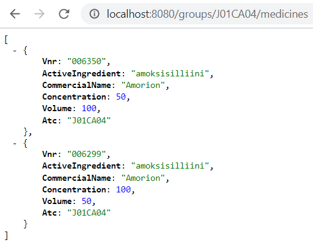

# Go Programming Course 2020 w22 - Project

A RESTful API -server that shows information about oral liquid medicines in JSON format.
In order to get the server running, [go](https://golang.org/) and [git](https://git-scm.com/download/) need to be installed.

Clone the project:
```
git clone https://github.com/marhyvar/go-server.git
```
Install gorilla/mux:
```
go get -u github.com/gorilla/mux
```
Go to the go-server folder and run these commands to start the server:
```
cd go-server
go run server.go
```

Open your browser and go to: http://localhost:8080/

## API Endpoints

> Method | Url | Action
> ------ | ------ | ------
> GET | medicines | Get all medicines
> GET | medicines/:vnr |  Get medicine by vnr
> GET | groups/:atc/medicines |  Get medicines by atc code
> POST | medicines | Add new medicine
> PUT | medicines/:vnr | Edit medicine by vnr
> DELETE | medicines/:vnr | Delete medicine by vnr



This repository contains also pre-built binaries for Mac, Linux and Windows. This project is the final exercise for Tero Karvinen's Go Programming Course 2020.

## References

[Link to course materials](http://terokarvinen.com/2020/go-programming-course-2020-w22/)

[Creating a RESTful API With Golang](https://tutorialedge.net/golang/creating-restful-api-with-golang/)

[Build a RESTful JSON API with Golang](https://medium.com/the-andela-way/build-a-restful-json-api-with-golang-85a83420c9da)

[gorilla/mux](https://github.com/gorilla/mux)

[Routing (using gorilla/mux)](https://gowebexamples.com/routes-using-gorilla-mux/)

[Understanding Arrays and Slices in Go](https://www.digitalocean.com/community/tutorials/understanding-arrays-and-slices-in-go)

[Go by Example - Http-servers](https://gobyexample.com/http-servers)